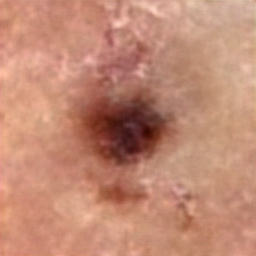
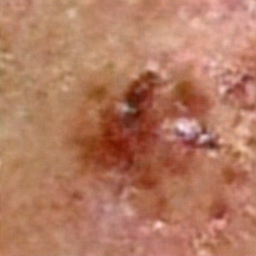
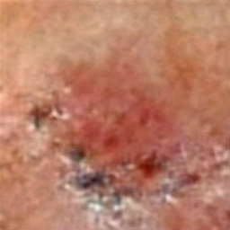

# Synthetic Data Generation for Skin Lesion Analysis

This repository demonstrates the use of Generative Adversarial Networks (GANs) to create synthetic images of malignant skin lesions. The implementation is inspired by **MelanoGAN** and designed for augmentation of limited datasets.

## Features
- **Custom GAN Architecture:** Includes Residual Blocks and Upsampling for high-quality image synthesis.
- **Training Pipeline:** Trains a GAN on a limited dataset of malignant skin lesion images.
- **Synthetic Data Generation:** Produces synthetic images for data augmentation and downstream tasks.

## File Structure
- `gan_training.py`: Script for GAN training and synthetic image generation.
- `dataset_loader.py`: Dataset preparation and transformations for malignant images.
- `notebooks/synthetic_data_demo.ipynb`: Jupyter Notebook for running experiments and generating synthetic data.
- `data/malignant_images/`: Folder containing the original dataset of malignant images.
- `data/generated_images/`: Folder containing the generated synthetic images.

## Results: Generated Images
Below are examples of synthetic images generated by the GAN during fine-tuning:

### **Fine-Tuning Epoch 0**


### **Fine-Tuning Epoch 5**


### **Fine-Tuning Epoch 15**


These images demonstrate the ability of the GAN to create realistic and diverse synthetic data.

## How to Use
1. Clone the repository:
   ```bash
   git clone https://github.com/DevDizzle/synthetic-data-GANerator.git
